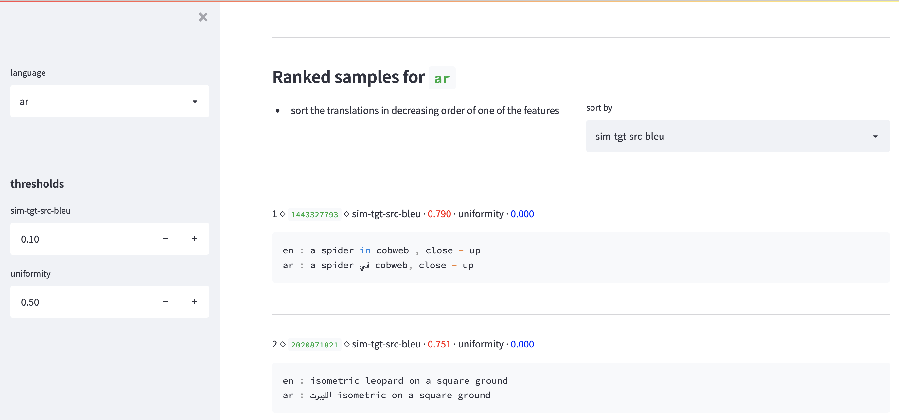

Analysis of the translations' quality for the [TD-MML](https://github.com/danoneata/td-mml) project.

To run use the following command:
```bash
streamlit run show_analysis_translations_basic.py
```

Streamlit can be installed via `pip`:
```bash
pip install streamlit
```

Example output:

